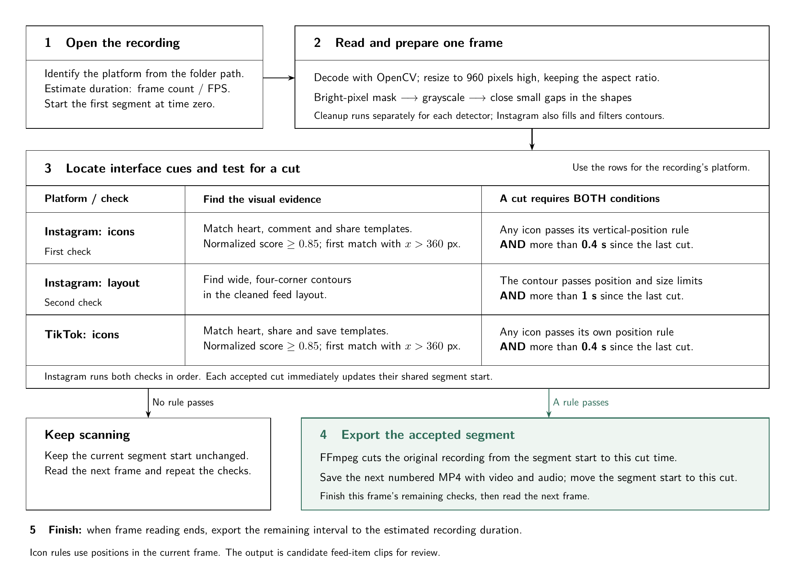

# IG-TK-Spliter

**Split an Instagram or TikTok MP4 screen recording into individual clips.**

OpenCV detect interface cues + FFmpeg exports the resulting intervals.

The original recording is kept. Install it once, then run `spliter` from any directory.




## Install

Use Python 3.10+ and FFmpeg 5.1+ with `ffmpeg` and `ffprobe` on your PATH.
FFmpeg must include the `libx264` encoder. Install FFmpeg through your system's
package manager or the [FFmpeg download page](https://ffmpeg.org/download.html).

```bash
git clone https://github.com/econvaibhav/IG-TK-Spliter.git
cd IG-TK-Spliter
python3 -m venv .venv
```

Activate the environment with `source .venv/bin/activate` then:

```bash
python -m pip install .
ffmpeg -version
ffprobe -version
ffmpeg -hide_banner -h encoder=libx264
spliter doctor
```

The encoder command should describe `Encoder libx264`. `spliter doctor` checks
Python dependencies, all six matching images, and a real temporary H.264/AAC
export. A version check alone does not confirm that the required encoder works.
The diagnostic creates its own tiny test clip and removes it afterwards.

The distribution is named `ig-tk-spliter`; its command and import package are
`spliter`.

### Fedora: enable H.264 export

If exporting fails with `Unknown encoder 'libx264'`, install the full FFmpeg
build from RPM Fusion. These steps enable its free repository and replace
`ffmpeg-free`. Run each command separately and review DNF's proposed package
changes before confirming:

```bash
sudo dnf install "https://download1.rpmfusion.org/free/fedora/rpmfusion-free-release-$(rpm -E %fedora).noarch.rpm"
sudo dnf swap ffmpeg-free ffmpeg --allowerasing
```

Then check that the encoder is listed:

```bash
ffmpeg -hide_banner -encoders 2>/dev/null | grep libx264
```

Continue once a line containing `libx264` appears.

## Split one recording

The input can be anywhere; it does not need a particular folder structure.
Quote paths containing spaces. Use the full platform name or its short alias
(`ig` for Instagram, `tk` for TikTok):

```bash
spliter "/path/to/recording.mp4" --platform instagram
spliter "/path/to/recording.mp4" --platform tiktok --output "/path/to/new_clips"
```

The default output is a new `recording_splits` folder beside the input.
With `--output split_run`, clips go into `split_run` under your terminal's current
directory. Use an absolute output path to choose the location explicitly. For
example, on Linux or macOS:

```bash
spliter "$HOME/Downloads/video_TK.mp4" \
  --platform tiktok \
  --output "$HOME/Downloads/video_TK_clips"
```

An existing output folder is refused: choose a different `--output` for another
run. A failed export can leave a folder containing its report or completed clips.
After fixing the error, select a new output folder; no deletion is required.
The original MP4 is preserved.

| Option | Meaning |
| --- | --- |
| `--platform instagram\|tiktok\|ig\|tk` | Detector selection|
| `--output PATH` | New folder for clips and reports |
| `--instagram-mode both\|reels\|feed` | Both Instagram checks by default; restrict them when the recording contains only one interface |
| `--threshold 0.85` | Normalized icon-match threshold; increasing it accepts fewer matches |
| `--templates-dir PATH` | Folder containing the selected platform’s replacement PNGs, using the existing filenames |
| `--detect-only` | Write boundaries and a report without encoding clips |

For example, inspect candidate boundaries in a Reels-only recording:

```bash
spliter recording.mp4 --platform instagram --instagram-mode reels --detect-only --output preview
```

Use a separate directory for the real export after a preview:

```bash
spliter recording.mp4 --platform instagram --instagram-mode reels --output clips
```

Open several exported clips and check the start/end times in `segments.csv`.
A successful run alone does not establish that each interval is one post.
For several files, run the command once per recording with a distinct output
folder. Choose the platform for each recording explicitly.


## Matching images

The original six templates are included in the installed package and kept in separate platform folders:

| Platform | Folder | Images |
| --- | --- | --- |
| Instagram | `spliter/templates/instagram/` | [Heart](spliter/templates/instagram/IG_heart_template.png), [comment](spliter/templates/instagram/IG_comment_template.png), [share](spliter/templates/instagram/IG_share_template.png) |
| TikTok | `spliter/templates/tiktok/` | [Heart](spliter/templates/tiktok/TK_heart_template.png), [share](spliter/templates/tiktok/TK_share_template.png), [save](spliter/templates/tiktok/TK_save_template.png) |

These are the actual matching images, not illustrations. Their bytes are unchanged.
The default folder is selected automatically by `--platform`. For replacement
Instagram templates, for example, use `--templates-dir /path/to/my_instagram_icons`.

## What you get

- `part_0001.mp4`, `part_0002.mp4`, ...: consecutive candidate intervals.
- `segments.csv`: filename, start, end, duration, boundary reason and whether
  the interval was exported.
- `report.json`: input, settings, decoded frame count, warnings and run status.

With `--detect-only`, MP4s are not created; CSV filenames describe planned clips.
No detected boundaries means one whole-recording interval, marked for review.


Clips use H.264 video and AAC audio when the recording has audio. Silent recordings
are supported. 

The 960-pixel analysis image is never used as the exported video.

## Detection method

1. **Read and prepare frames.** Decode each frame and resize it to height
   `H = 960`, preserving aspect ratio.
2. **Isolate bright shapes.** Mask each BGR channel, convert to grayscale, and
   close gaps using a 2-by-2 elliptical kernel.
3. **Find interface evidence.** Match icon templates and, for Instagram feed
   views, inspect wide four-corner shapes.
4. **Accept a boundary.** Apply the detector's position rule and minimum elapsed
   time since the previous accepted cut.
5. **Export and continue.** Export from the previous cut to this boundary, then
   continue reading. Export the remaining tail at the end.

| Detector | Frame cleanup | Position rule at height 960 | Minimum gap |
| --- | --- | --- | --- |
| Instagram icons | BGR 230–255; fill contours with area >50 | Heart, comment or share: `90 < y < 860` and either `y < 320` or `y > 807.62` | Strictly >0.4 s |
| Instagram feed | BGR 250–255; contour fill, dilation, erosion, side borders and inversion | Four-corner contour: width >image width−20; `45 ≤ y ≤ 120`; `150 ≤ height ≤ 200` | Strictly >1 s |
| TikTok icons | BGR 220–255; no contour fill | Heart `y ≤ 480`, share `y ≤ 600`, or save `y ≤ 564.71`; each also accepts `y > 807.62` | Strictly >0.4 s |

Icon matching uses `TM_CCOEFF_NORMED` and accepts scores at least the selected
threshold, normally 0.85. 


## Files

| File | Purpose |
| --- | --- |
| `main.py` | Small launcher, preserving the existing command |
| `spliter/cli.py` | Arguments, platform aliases and terminal selection |
| `spliter/doctor.py` | Dependency, template and real encoding checks |
| `spliter/video_processor.py` | Validation, frame reading, matching, export and reports |
| `spliter/instagram_processor.py` | Instagram icon and feed-layout rules |
| `spliter/tiktok_processor.py` | TikTok icon rules |
| `spliter/templates/instagram/` | Three Instagram matching templates |
| `spliter/templates/tiktok/` | Three TikTok matching templates |
| `workflow.png` | Workflow image displayed above |
| `requirements.txt` | OpenCV and NumPy dependencies, also read by package metadata |
| `pyproject.toml` | Package metadata, installed command and bundled data |
| `MANIFEST.in` | Files included in source distributions |
| `environment.yml` | Optional Conda / Tykky environment with FFmpeg |
| `tests/` | Generated-video and installation checks |
| `.github/workflows/python-package.yml` | Build, lint and test automation |

Developed by **Andrew Zaki (University of Helsinki)** and **Vaibhav Agarwal (University of Helsinki, Technical University of Munich)** for the various funded research projects at **HEPP Consortium (Helsinki Hub on Emotions, Populism and Polarisation)**. 
